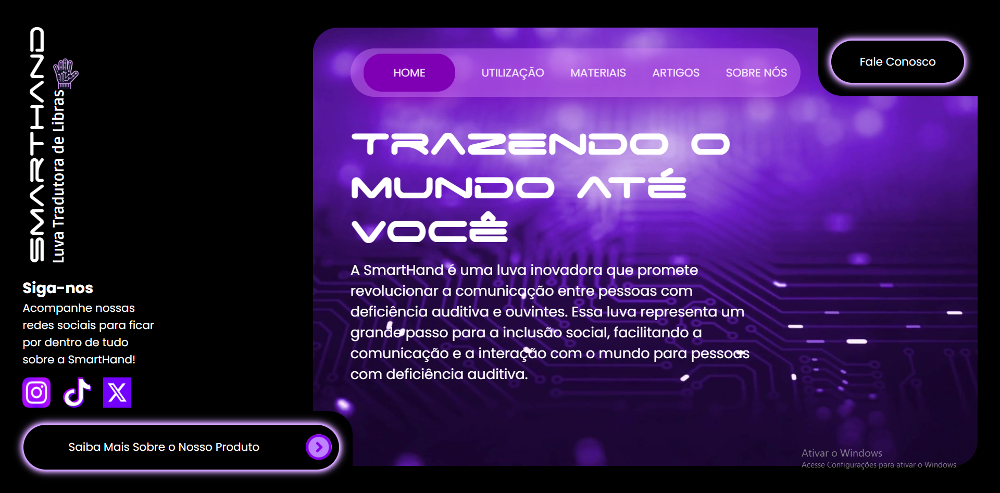

# Smart Hand – Luva Tradutora de Libras

- https://smart-hand.vercel.app/

## Sobre o Projeto

O site apresenta a **Smart Hand**, uma luva tradutora de **LIBRAS** (Língua Brasileira de Sinais) feita com micro-controlador Arduino nano e sensores, toda base de código para o funcionamento da luva foi feita em C++. O objetivo central é derrubar barreiras linguísticas, permitindo que pessoas que não conhecem LIBRAS se comuniquem de maneira eficaz com deficientes auditivos, por meio de uma tecnologia acessível, moderna e inclusiva.

## Funcionalidades do Site

- Apresentação clara do propósito do projeto e seu contexto científico e tecnológico.
- Links relevantes para artigos utilizados como base de pesquisa (ex.: revisões, estudos sobre linguagem de sinais, tecnologia assistiva).
- Design responsivo e navegação intuitiva.
- Componentização em **React**, com utilização de **Vite**, tornando o desenvolvimento ágil, moderno e eficiente.
- Hospedagem simples e robusta via **Vercel**.

## Quem Contribuiu

- **Anny Lamberti** - Designer UX/UI
- **Marcelo Alexandre** – Desenvolvedor  
- **Hector Pellegrino** – Desenvolvedor
- **Raquel Ramos** - Engenheira de Software
## Tecnologias Utilizadas

- **JavaScript** (metodos nativos do JS para automatizar a criação de componentes)
- **React** (biblioteca principal de frontend)
- **Vite** (ferramenta de build e servidor local rápido)
- **styled-components** (para estilização baseada em componentes)
- **React Router Dom** (para navegação entre seções do site)
- **Vercel** (plataforma de hospedagem com deploy contínuo)

